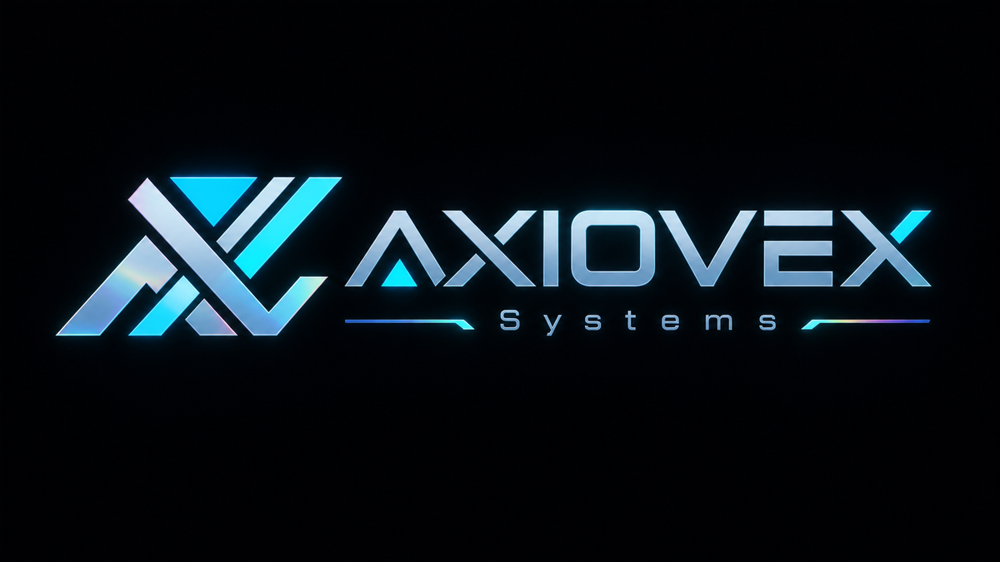

  

<h1 align="center">Engineering clarity into difficult systems.</h1>

  Expert consultancy · Technical contracting · Rapid-response engineering

  🌐 <a href="https://axiovexsystems.com"><strong>axiovexsystems.com</strong></a>

AXIOVEX helps organizations solve complex, high-consequence, and time-sensitive problems. We turn ambiguity into an executable system: establish what is known, expose assumptions and uncertainty, design the decision architecture, and build solutions that hold up in the real world.

## What we do

- **Epistemic solutions** — evidence-centered systems that make knowledge, uncertainty, assumptions, and decision criteria explicit.
- **Solution framework engineering** — reusable architectures, methods, controls, and tools that turn one successful intervention into a repeatable capability.
- **Optimization** — technical, operational, economic, process, resource, reliability, and decision optimization across entire systems rather than isolated symptoms.
- **Invention and applied R&D** — original mechanisms, prototypes, software, workflows, and problem-specific technologies when an off-the-shelf answer does not exist.
- **Rapid-response engineering** — focused diagnosis and execution for difficult missions where time, risk, or consequence rules out business as usual.
- **Technical delivery systems** — analytics, automation, implementation plans, governance, validation, and measurable outcome frameworks.

## An elite rapid-response model

AXIOVEX assembles compact, elite engineering teams for missions that demand unusual depth, adaptability, discretion, and speed. Think special-operations discipline applied to engineering: small expert teams, high trust, rigorous preparation, decisive execution, and relentless focus on the objective.

We are built for problems that cross disciplines, resist conventional playbooks, or have already defeated ordinary approaches. The goal is not activity. The goal is a defensible solution that works under real constraints.

## How we work

1. **Frame the real problem.** Separate symptoms from causes, facts from assumptions, and constraints from habits.
2. **Build the evidence model.** Define what must be known, how it will be measured, and how uncertainty affects the decision.
3. **Engineer the solution system.** Integrate people, process, technology, economics, risk, and governance.
4. **Test before scaling.** Prototype, validate, stress-test, and compare alternatives against explicit success criteria.
5. **Transfer durable capability.** Deliver reusable frameworks, documentation, controls, and tools—not a dependency on presentationware.

## When to bring us in

- The problem is strategically important but poorly defined.
- Multiple disciplines or systems must be solved together.
- Existing vendors, tools, or methods are too narrow.
- The cost of delay, failure, or a weak decision is high.
- A novel invention, optimization, or operating model may be required.
- Leadership needs both expert reasoning and hands-on technical execution.

AXIOVEX works through focused advisory engagements, diagnostics, architecture and optimization projects, prototypes, rescue engagements, and embedded technical contracting. Sensitive work is handled with disciplined information boundaries and client-specific repositories.

  <strong>Difficult problem. Clear evidence. Engineered solution.</strong>

